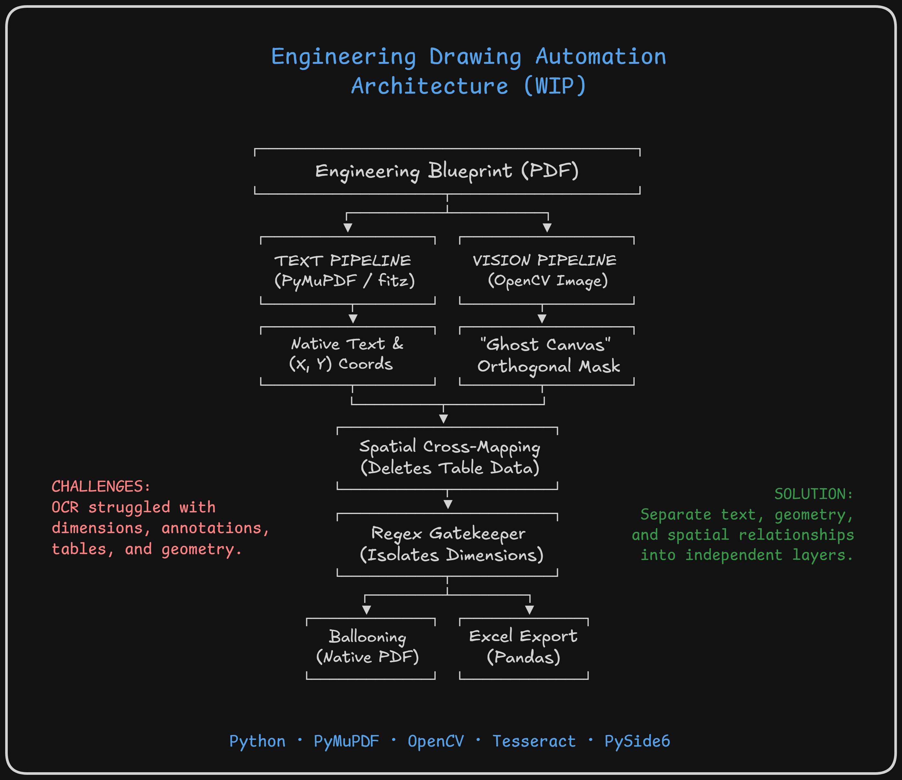
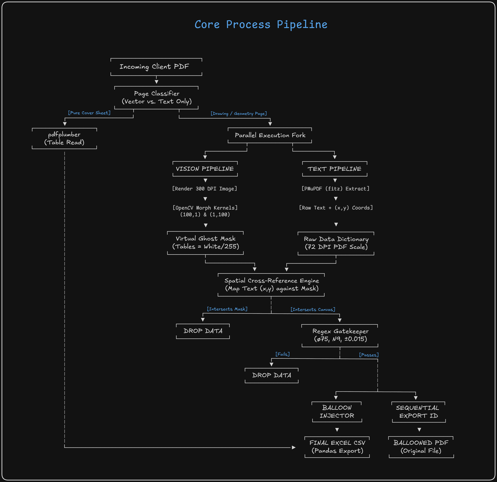

<div align="center">
    
# Engineering Drawing Automation System <br>

</div>

> **Version:** 2.0 (Ghost Canvas Architecture) &nbsp;|&nbsp; **Platform:** Windows Desktop &nbsp;|&nbsp; **Technology:** Python + PySide6

An enterprise-grade, fully offline desktop application that automates the extraction of critical engineering parameters — dimensions, tolerances, notes, and metadata — from complex PDF engineering drawings. Utilizing a Non-Destructive Spatial-Text Pipeline, it intelligently isolates manufacturing geometry from structured tabular data to eliminate manual effort, human error, and inconsistency in generating inspection-ready Excel sheets.


## Table of Contents

1. [Project Overview](#1-project-overview)
2. [Business Problem & Proposed Solution](#2-business-problem--proposed-solution)
3. [Key Features (2.0)](#3-key-features)
4. [Architecture Overview](#4-architecture-overview)
5. [Folder Structure](#5-folder-structure)
6. [Module Breakdown](#6-module-breakdown)
7. [Core Processing Pipeline](#7-core-processing-pipeline)
8. [Backup & Disaster Recovery (BDR)](#8-backup--disaster-recovery-bdr)
9. [Data Model](#9-data-model)
10. [User Interface](#10-user-interface)
11. [Functional Requirements](#11-functional-requirements)
12. [Non-Functional Requirements](#12-non-functional-requirements)
13. [Security & Privacy](#13-security--privacy)
14. [Installation & Deployment](#14-installation--deployment)
15. [Building the Executable](#15-building-the-executable)
16. [Running Tests](#16-running-tests)
17. [Success Metrics](#17-success-metrics)
18. [Roadmap & Future Phases](#18-roadmap--future-phases)

<br>

## 1. Project Overview

The **Engineering Drawing Automation System (V2)** replaces error-prone OCR workflows with an intelligent, spatial cross-reference engine. Engineers no longer need to hand-read PDF drawings, manually copy dimensions into spreadsheets, or hand-number balloons on prints.

| Attribute | Detail |
|---|---|
| **Application Type** | Offline Desktop Application |
| **Architecture** | Layered Modular (MVC) / Ghost Canvas Spatial Pipeline |
| **Target OS** | Windows (7, 10, 11) |
| **Primary Language** | Python 3.10+ |
| **UI Framework** | PySide6 (Qt6) |
| **Core Extraction** | Native PyMuPDF (99% accurate vector parsing) |
| **Vision Masking** | OpenCV (Orthogonal Grid Detection) |
| **OCR Fallback** | PyTesseract (For Scanned Document Only) |
| **Deployment** | PyInstaller `.exe` (zero-dependency) |
| **Network Requirement** | None — fully air-gapped |

<br>

## 2. Business Problem & Proposed Solution

### Current (Manual / Standard OCR) Process

Standard OCR engines fail on complex manufacturing exports because they cannot differentiate between actual part geometry and dense metadata tables when they are placed millimeters apart. This leads to massive, scrambled text blocks and hallucinated tolerances.

**Problems with current process:**

- Highly time-consuming per drawing
- Prone to human transcription errors
- Dimensions are frequently missed
- Reports are inconsistent across engineers
- Poor traceability between drawing and inspection record

### Proposed Automated Solution (v2 Architecture)

```
User loads multi-page CAD PDF into the application
        ↓
System bypasses OCR, natively extracts Text & (x,y) Bounding Boxes
        ↓
System uses OpenCV to create a "Ghost Canvas" that masks out all tables
        ↓
System maps Text (x,y) against the Ghost Canvas to isolate Pure Geometry
        ↓
Regex Gatekeeper validates tolerances, dimensions, and callouts
        ↓
System auto-generates ballooned PDF & Excel inspection sheet
```

The entire extraction-to-export pipeline runs automatically, with the engineer only providing semantic labels (e.g., "Product Parameter") before final export.

<br>

## 3. Key Features

### Intelligent Page Routing
Automatically reads PDF metadata to identify pure text cover sheets versus drawing canvases, preventing erroneous image processing on non-geometry pages.

### Virtual Grid Masking
Uses OpenCV morphological kernels `(100,1)` to automatically detect and virtually erase orthogonal tables and title blocks without destroying the original PDF.

### Native Text Extraction (Zero OCR)
Bypasses OCR entirely for native digital CAD PDFs. Utilizes PyMuPDF to extract embedded text strings and exact coordinate data, ensuring 100% text accuracy for complex tolerances `(±0.015)` and symbols `(Ø, °)`.

### Backup & Disaster Recovery (BDR)
A dedicated `BDRService` implements an **Atomic Save Pattern** using `os.replace()` to prevent file corruption on sudden crashes. It maintains a rolling history of up to 100 snapshots with automatic recovery on startup.

### Spatial Cross-Referencing & Regex Gatekeeper
Mathematically cross-references text coordinates against the virtual Ghost Mask to eliminate tabular data. Surviving text is pushed through strict regex inclusion rules to isolate valid engineering parameters `(ø75, (130), N9)`.

### Non-Destructive Ballooning
Calculates center points and draws sequential identification balloons natively on a copy of the PDF, keeping the original CAD vector layers completely intact.

### Air-Gapped & Secure
All processing happens entirely on the local machine. IP and proprietary drawing data never leave the workstation.

<br>

## 4. Architecture Overview

The application completely separates Text extraction from **Vision Processing**, merging them only at the **Cross-Mapping** stage.



<br>

## 5. Folder Structure

```text
EngineeringDrawingAutomation/
│
├── main.py                        # Application entry point
├── requirements.txt               # Runtime dependencies
├── requirements-build.txt         # Build-time dependencies (PyInstaller)
│
├── ui/                            # PySide6 frontend views
│   ├── themes/
│   │   ├── dark_theme.qss
│   │   ├── light_theme.qss
│   │   └── theme_manager.py
│   └── ...                        # Page widgets (dashboard, process, results, etc.)
│
├── controllers/                   # Business logic & UI orchestration
│   ├── app_controller.py
│   ├── process_controller.py
│   └── export_controller.py
│
├── services/                      # Core utility & logic services
│   ├── bdr_service.py             # Atomic Save Pattern & Recovery
│   ├── extraction_service.py      # Master Director (Cross-References Vision & Text)
│   ├── vision_service.py          # OpenCV Grid Detection & Ghost Masking
│   ├── ocr_service.py             # FALLBACK ONLY: Legacy Tesseract for scanned photos
│   └── regex_filter.py            # Alphanumeric dimension gatekeeper
│
├── parsers/                       # PDF parsing layer (PyMuPDF)
│   └── pdf_parser.py              # PyMuPDF text & coordinate extraction
│
├── exporters/                     # File output modules
│   ├── excel_exporter.py          
│   └── balloon_service.py         # Native PyMuPDF annotation drawing
│
├── models/                        # Pydantic data validation models
│   └── parameter.py
│
├── config/                        # App configuration
│   └── user_settings.yaml
│
├── resources/                     # Icons, fonts, assets
│
├── output/                        # Default output directory for generated files
│
├── logs/
│   └── pipeline.log
│
└── tests/                         # Pytest unit test suite
```

<br>

## 6. Module Breakdown

### UI Layer (`ui/`)

Hosts all PySide6 page widgets and the theme engine. Renders five primary pages:

| Page | Purpose |
|---|---|
| Dashboard | System overview — statistics cards, activity feed, quick actions |
| Process PDF | Drag-and-drop upload, file queue, processing configuration |
| Results | Extracted parameter table with search, filters, and drawing preview |
| Reports | Historical report listing, open file, export actions, statistics |
| Settings | Appearance, processing options, export configuration |

### Controller Layer (`controllers/`)

Orchestrates multi-step workflows (e.g., PDF load → extract → mask → balloon → export), and manages cross-tab UI navigation.

| File | Responsibility |
|---|---|
| `app_controller.py` | Application lifecycle, global state |
| `process_controller.py` | PDF processing workflow orchestration |
| `export_controller.py` | Export pipeline (Excel + PDF) coordination |

### Service Layer (`services/`)

Contains all business logic, keeping controllers thin.

| File | Responsibility |
|---|---|
| `extraction_service.py` | The Director. Maps native PDF coordinates onto the OpenCV Mask to separate geometry from tables. |
| `vision_service.py` | Renders the page, runs large morphological kernels to locate grids, and returns a binary blackout mask. |
| `regex_filter.py` | Applies strict filters to preserve alphanumeric `(N9)`, bracketed (`(75)`), and symbolic (`Ø75`) dimensions. |
| `ocr_service.py` | The Fallback. Only triggers if `PDFParser` detects 0 native text blocks (indicating a physical paper scan). |

### Export Engine (`exporters/`)

| Module | What It Extracts |
|---|---|
| `excel_exporter.py` | Layout Inscpection Excel sheet via openpyxl. |
| `balloon_service.py` | Calculates and places sequential marks natively at extracted PyMuPDF co-ordinates. |


<br>

## 7. Core Processing Pipeline

The pipeline runs inside `OCRService` and `ExtractionService`:




<br>

## 8. Backup & Disaster Recovery (BDR)

`bdr_service.py` implements a fully offline BDR strategy critical for air-gapped deployments where no external database or cloud backup exists.

### Atomic Save Pattern

Data is never written directly to the live JSON master file. Instead:

1. Content is written to a `.tmp` file.
2. The `.tmp` file is atomically swapped over the live file using `os.replace()`.
3. If the process crashes mid-write, the live file is never corrupted.

### Rolling Snapshots

- Up to **100 historical snapshots** are maintained automatically.
- Stored in a hidden `.drawing_automation_backup/` directory.
- Oldest snapshots are pruned as new ones are added.

### Automatic Recovery on Startup

- On every application launch, the BDR service validates all core configuration files.
- If corruption is detected, it instantly reconstructs application state from the latest stable snapshot.
- Zero manual intervention required.


<br>

## 9. Data Model

Every extracted engineering parameter is stored as a validated `Parameter` object:

```python
class Parameter:
    serial_no: int          # Auto-assigned balloon number (= Excel SL NO)
    specification: str      # Extracted dimension or callout value
    tolerance: str          # Associated tolerance string (if present)
    page_no: int            # Source PDF page number
    x: float                # X coordinate on drawing canvas
    y: float                # Y coordinate on drawing canvas
```

The `ExtractionResult` object aggregates all `Parameter` instances from a single PDF run and is passed to both the Excel exporter and the balloon placement engine.

### Excel Output Format

| SL NO | Product Parameter | Specification | Tolerance | Checking Method | Observation | Remarks |
|---|---|---|---|---|---|---|
| Auto-filled | Manual | Auto-filled | Auto-filled | Manual | Manual | Manual |

<br>

## 10. User Interface

### Responsive Behavior

- Maximizes automatically on launch.
- Scales according to screen resolution with High DPI support.
- Supported resolutions: `1366×768`, `1920×1080`, `2560×1440`, `4K`.

### Pages

#### Dashboard
Provides an at-a-glance system overview:
- Statistics cards: Total Drawings, Total Parameters, Total Reports.
- Dynamic doughnut charts.
- Recent Activity feed.
- Last Processed Drawing preview.
- Quick Action shortcuts.

#### Process PDF
- Drag-and-drop upload zone.
- Multi-file queue with status indicators.
- Processing options (toggle balloon generation, Excel generation, metadata extraction, notes extraction).
- Output folder selector.
- Process button.

#### Results
- Full parameter table with columns: SL NO, Specification, Tolerance, Source PDF, Page.
- Search and filter controls.
- Side-by-side drawing preview panel.
- Export button.

#### Reports
- Complete historical log of generated Excel and PDF files.
- Open file directly, open containing folder, or re-export.
- Summary statistics for the session.

#### Settings

| Section | Options |
|---|---|
| **Appearance** | Theme (Dark / Light), Font Size (Small / Medium / Large / Extra Large), Font Family (Segoe UI / Arial / Calibri / Roboto) |
| **Processing** | Generate Balloon PDF, Generate Excel, Extract Metadata, Extract Notes, Auto Open Results |
| **Export** | Output Folder path, Create Date Subfolder, Open Output Folder on export, Export Format (Excel / PDF / Both) |

All theme and font changes apply **immediately**, with no restart required.

### Theme Architecture

```text
ui/themes/
├── dark_theme.qss      # Default dark mode stylesheet
├── light_theme.qss     # Light mode stylesheet
└── theme_manager.py    # Runtime theme switching logic
```

<br>

## 11. Functional Requirements

| ID | Requirement | Details |
|---|---|---|
| FR-001 | PDF Import | Select, drag-and-drop, or batch-upload PDFs. Supports native vector PDFs and scanned PDFs. |
| FR-002 | Parameter Extraction | Extract all engineering specifications — dimensions (`91.4`, `308`), diameters (`Ø75`), radii (`R12`), threads (`M10`), chamfers (`0.5×20`), and callouts. |
| FR-003 | Tolerance Extraction | Extract symmetric (`±0.015`, `±0.5`) and asymmetric (`+0.2 / -0.1`) tolerances, stored separately from specifications. |
| FR-004 | Balloon Generation | Auto-assign sequential balloon numbers (1, 2, 3…) to each specification, matching Excel SL NO. |
| FR-005 | Excel Generation | Auto-populate RSB inspection template with SL NO, Specification, and Tolerance. Manual fields remain editable. |
| FR-006 | Metadata Extraction | Extract Drawing Number, Part Number, Revision, Material, Scale, and Date from the title block. |
| FR-007 | Notes Extraction | Extract General, Manufacturing, and Surface Finish notes. |
| FR-008 | Report Export | Export ballooned PDF and/or populated Excel sheet to a user-defined output folder. |

> **Phase 1 — Not Supported:** DWG and DXF file formats.

<br>

## 12. Non-Functional Requirements

| Category | Requirement |
|---|---|
| **Performance** | Processing time under 10 seconds for a typical engineering drawing |
| **Startup Time** | Application launch in under 3 seconds |
| **Availability** | Fully offline — no internet connection required at any time |
| **Security** | All processing is local; no data transmitted externally |
| **Scalability** | Batch processing of multiple PDFs in a single session |
| **Reliability** | Zero data loss — Atomic Save Pattern prevents corruption |
| **Compatibility** | Windows 7 / 10 / 11, screen resolutions from 1366×768 to 4K |

<br>

## 13. Security & Privacy

The application is designed from the ground up to protect proprietary engineering IP.

### Data Flow

```
PDF (local file)
      ↓
Local Processing (OpenCV + Tesseract)
      ↓
Local Output (Excel + Ballooned PDF)
```

No data ever leaves the machine.

### Security Constraints

| Constraint | Status |
|---|---|
| Cloud services | ❌ None |
| External APIs | ❌ None |
| Network sockets | ❌ None |
| Remote execution | ❌ None |
| External database | ❌ None |
| Internet connectivity | ❌ Not required |

### File Operations

The application is restricted to:
- **File Read** — PDF inputs
- **File Write** — Excel + PDF outputs, config, logs, BDR snapshots

### Audit Logging

All significant events are recorded to `logs/application.log`:

- Application start
- PDF processing events (start, completion, errors)
- Export operations
- System errors

### Application Configuration

```
config/user_settings.yaml   # User preferences and app config
logs/application.log        # Operational audit log
output/                     # All generated files (user-controlled)
```

<br>

## 14. Installation & Deployment

### Option A — End-User (Compiled Executable)

For client workstations with no Python or IDE installed, use the pre-built `.exe` provided by the engineering team. No setup required — simply run the executable.

### Option B — Developer (Source)

**Prerequisites:**

- Python 3.9+
- pip
- Tesseract OCR binary (for development only)

**Setup:**

```powershell
# Clone or extract project
cd EngineeringDrawingAutomation

# Create virtual environment
python -m venv venv
venv\Scripts\activate

# Install dependencies
pip install -r requirements-dev.txt

# Run the application
python main.py
```

<br>

## 15. Building the Executable

To compile the application into a standalone Windows executable using PyInstaller:

**Prerequisites:**

- Ensure `tesseract_bin/tesseract.exe` is present in the project root before building.
- Install build dependencies: `pip install -r requirements-build.txt`

**Build Command:**

```powershell
pyinstaller --noconfirm --onedir --windowed --add-data "tesseract_bin/;tesseract_bin/" --paths="." main.py
```

**Flag Reference:**

| Flag | Purpose |
|---|---|
| `--noconfirm` | Overwrites previous build output without prompting |
| `--onedir` | Packages into a directory rather than a single file — prevents long extraction delays for heavy OpenCV pipelines |
| `--windowed` | Suppresses the console window on launch |
| `--add-data "tesseract_bin/;tesseract_bin/"` | Embeds the local Tesseract binary directory into the bundle |
| `--paths="."` | Forces PyInstaller to resolve all internal modular imports from the project root |

At runtime, `ocr_service.py` dynamically resolves the Tesseract binary path via `sys._MEIPASS` when the application is running as a frozen PyInstaller bundle.

**Output:** `dist/main/` — a self-contained directory ready for deployment to any Windows workstation.


<br>

## 16. Running Tests

A comprehensive Pytest unit test suite is located in the `tests/` directory.

```powershell
venv\Scripts\python -m pytest tests\test_bdr_service.py tests\test_ocr_upgrades.py --cov=services --cov-report=term-missing
```

| Test File | What It Tests |
|---|---|
| `test_bdr_service.py` | BDR robustness — atomic saves, snapshot rotation, crash recovery, corruption detection |
| `test_ocr_upgrades.py` | Image splitting, dynamic segmentation, CCA filter accuracy |

The `--cov=services --cov-report=term-missing` flags generate a coverage report for the `services/` layer, identifying any untested lines.


<br>

## 17. Success Metrics

| Metric | Target |
|---|---|
| Dimension Detection Accuracy | ≥ 98% |
| Tolerance Detection Accuracy | ≥ 95% |
| Excel Generation Success Rate | 100% |
| Application Startup Time | < 3 seconds |
| Per-Drawing Processing Time | < 10 seconds |


<br>

## 18. Roadmap & Future Phases

| Phase | Planned Features |
|---|---|
| **Phase 1 (Current)** | PDF import, specification & tolerance extraction, balloon generation, Excel export, BDR, PyInstaller deployment |
| **Phase 2** | DWG / DXF file format support |
| **Phase 2** | Multi-user login & role-based access control |
| **Phase 2** | Network-shared output directory support |
| **Future** | AI-assisted parameter classification |
| **Future** | Direct ERP / MES integration for inspection record submission |


## Dependencies

```
# Runtime (requirements.txt)
PySide6            # Qt6 UI framework
PyMuPDF            # PDF parsing and coordinate extraction
opencv-python      # Image processing, segmentation, CCA
pytesseract        # Tesseract OCR Python wrapper
Pillow             # Image handling
openpyxl           # Excel report generation
pydantic           # Data validation models
PyYAML             # Config file parsing

# Development (requirements-dev.txt)
pytest>=7.0.0      # Testing
pytest-cov>=3.0.0
black>=22.0.0      # Code Formatting
isort>=5.0.0
flake8>=4.0.0      # Linting
mypy>=0.910        # Type Checking
pre-commit>=2.0.0  # Pre-commit Hooks
ipython>=7.0.0     # Debugging

# Build (requirements-build.txt)
pyinstaller      # Standalone .exe packaging
```

<br>
<div align="center">

*Engineering Drawing Automation System — Version 2.0*

</div>
